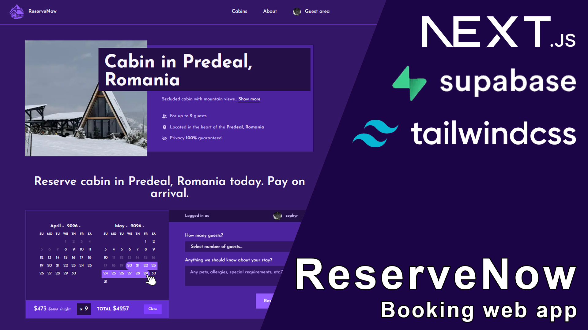

This is a booking app build with [Next.js](https://nextjs.org/). 

Below are the instructions on how you can run the app.

Make sure you have [Node.js](https://nodejs.org/en) and [Git](https://git-scm.com/install/windows) installed.

# ReserveNow Booking App



## 1. Clone this repository

Right click on the desktop.

Click Open Git Bash here. 

Right click in the terminal window and paste the command below by copying it and pressing shift + ins.

```bash
git clone https://github.com/marko-stupin/reserve-now.git
```

Press Enter.

## 2. Open [Visual Studio Code]([https://nextjs.org/](https://code.visualstudio.com/)).

In the terminal window now paste this (shift + ins) and press Enter. 

```bash
code reserve-now
```

## 3. Adding environment variables 

Insine the reserve-now folder you need to add .env.local file that I will send you privately. 

This contains all of the environment variables that will make the app work. 

The file should look something like this.

```bash
SUPABASE_URL=
SUPABASE_KEY=

NEXTAUTH_URL=http://localhost:3000/
NEXTAUTH_SECRET=

AUTH_GOOGLE_ID=
AUTH_GOOGLE_SECRET=
```

## 4. Installing packagaes 

Inside Visual Studio Code.

Press ctrl + button under escape.

In the terminal type.

```bash
npm i 
```

Press Enter. 

## 5. Running the app

After all of the packages have been installed.

Type in the terninal window inside vs code. 

```bash
npm run dev
```

Press Enter.

Press alt + left click on localhost:3000 inside vs code terninal window.

**App will open up in the browser**
